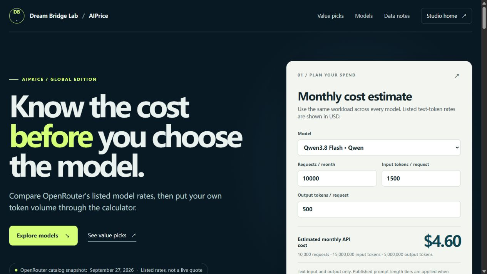

# AIPrice Global — model pricing & cost estimation

**English** · [简体中文](README.zh-CN.md)

**Project:** independently built studio product. **Role:** data importer, interactive front end, deployment, and documentation.

[Try AIPrice Global](https://yourdreamlab.net/apps/aiprice/) · [Discuss a similar project](https://yourdreamlab.net/?view=build)

## The problem

Per-token rates alone do not show what a particular workload will cost. The goal was to let a developer compare expected monthly text-token costs using the same request count and token volumes, then choose models for a task-specific trial.

## What I built

- A Python importer for a dated selection of 80 text models from OpenRouter's public catalog, including normalized prices and available benchmark fields.
- A responsive JavaScript interface with model search, price tables, workload inputs, and linked model details.
- A cost estimator that applies published prompt-length tiers, plus an experimental benchmark-per-dollar shortlist that changes with the workload.
- A Cloudflare-hosted public product that visitors can try without supplying a model API key.

## Try the working features

1. Open the product and change the model, monthly request count, and input/output tokens per request.
2. Compare the recalculated costs in the model table; use search and the available filters to narrow the catalog.
3. Inspect the value shortlist and its data notes. The US-developer filter describes the model developer, not its hosting location.

## Product screenshot

Actual product screenshot captured on September 29, 2026. The displayed estimate uses the September 27, 2026 catalog snapshot and the workload shown in the image.

## Result and limits

The result is a published interactive product with a shared workload driving both the price comparison and shortlist. The public catalog contains 80 models. Responsive layouts were previously checked at 320 px and 390 px; the table scrolls within its container on small screens.

Prices are dated catalog snapshots, not live quotes. Estimates cover text input/output and exclude caching, tools, multimodal use, taxes, and route-specific billing. A benchmark ratio helps select candidates for testing; it does not measure quality on a customer's own task. Access to a model also depends on the provider's account and regional rules. This is my own product, with no claimed client results or cost savings.

## Related work and contact

This work demonstrates a scoped data-backed web app: import public data, explain its assumptions, build usable interactions, and publish the result. [AIPrice's public data, API documentation, and MCP project](https://github.com/lin113311221/aiprice) is a separate developer resource with its own catalog and endpoints.

[Contact Jake through Upwork](https://www.upwork.com/freelancers/~0165daf1eebdef9a04) · [Discuss a project](https://yourdreamlab.net/?view=build) · [Back to Dream Bridge Lab](https://github.com/dreambridgelab)
