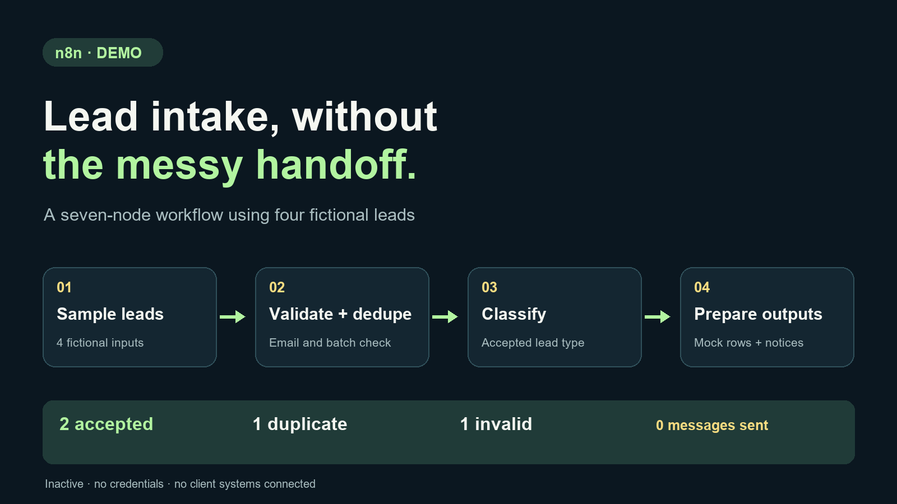

# n8n 线索接收：合成工作流演示

[English](README.md) · **简体中文**

**项目性质：**本人独立开发、使用虚构数据的演示。**负责范围：**工作流设计、校验与分类逻辑、本机执行和文档。

[查看工作流 JSON](../../demos/lead-intake-n8n.json) · [查看工作室演示条目](https://yourdreamlab.net/?view=journal) · [讨论自动化项目](https://yourdreamlab.net/?view=build)

## 要解决的问题

新线索在写入表格或通知团队之前，需要一致的校验规则和清楚的交接方式。这个演示先把规则展示出来，再讨论如何连接真实账号与客户系统。

## 我做了什么

一个由手动触发器启动的七节点 n8n 工作流：

`生成虚构线索 → 校验与同批去重 → 分类接受的线索 → 准备模拟表格行与通知 → 汇总`

输入为四条虚构的 `.test` 线索。代码检查邮箱字段、识别同批重复邮箱，并按关键词对接受的线索分类。输出节点在内存中准备模拟表格行、团队通知和提示。

## 工作流示意图

示意图把已验证的七节点流程归为四个阶段。它是流程图，不是客户 n8n 实例的截图。

## 已验证的演示结果

2026 年 9 月 28 日，已在本机 n8n 2.0.0 环境导入并实际执行该流程，执行结果没有报错。

| 输入或输出 | 数量 |
| --- | ---: |
| 虚构线索 | 4 |
| 接受的线索 | 2 |
| 同批重复 | 1 |
| 邮箱无效 | 1 |
| 模拟表格行 / 团队通知 / 提示 | 2 / 2 / 1 |
| 实际外发消息 | 0 |

## 查看与复现

1. [查看导出的 JSON](../../demos/lead-intake-n8n.json)，或[下载公开工作流](https://yourdreamlab.net/assets/demos/lead-intake-n8n.json)。
2. 导入 n8n 实例。已有验证环境为 n8n 2.0.0，其他版本尚未验证。
3. 保持工作流未激活，运行 Manual Trigger，并将最后汇总节点的结果与上表核对。

导出文件不含凭证，不进行外部写入或实际通知，也不会在不同运行之间保存去重历史。它与工作室官网的私密项目表单分开，不代表客户部署。

## 如何形成真实项目

实际集成前，先约定字段和已获授权的目标系统，增加持久去重与失败处理，再验收数据交接后投入使用。这个演示展示逻辑与可查看的输出，没有声称客户转化率或节省时间。

[通过 Upwork 联系 Jake](https://www.upwork.com/freelancers/~0165daf1eebdef9a04) · [讨论项目](https://yourdreamlab.net/?view=build) · [返回 Dream Bridge Lab](https://github.com/dreambridgelab/.github/blob/main/profile/README.zh-CN.md)
